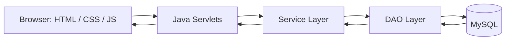

# 📚 Library Management System

### Java Servlet-Based Library & Book Circulation System

> A full-stack library management application with separate Student and Admin experiences — book search and issuing, due-date and fine tracking, and a MySQL-backed persistent state.

[](https://www.java.com/)
[](https://jakarta.ee/specifications/servlet/)
[](https://docs.oracle.com/javase/tutorial/jdbc/)
[](https://www.mysql.com/)
[](https://tomcat.apache.org/)
[](https://developer.mozilla.org/en-US/docs/Web/JavaScript)
[]()

🔗 **Live Demo:** [Library Management System](https://librarymanagement.blitz.cloud/LibraryManagement/)

📦 **Source Code:** [github.com/priyanshu-1git/Library-Management-System](https://github.com/priyanshu-1git/Library-Management-System)

---

## 📌 Table of Contents

- [Overview](#-overview)
- [Features](#-features)
- [Architecture](#️-architecture)
- [Business Rules](#-business-rules)
- [Book Circulation Flow](#-book-circulation-flow)
- [Technology Stack](#-technology-stack)
- [Repository Structure](#-repository-structure)
- [Getting Started](#-getting-started)
- [Demo Environment](#-demo-environment)
- [Known Limitations](#️-known-limitations)
- [Future Improvements](#-future-improvements)
- [Project Evolution](#-project-evolution)
- [Author](#-author)

---

## 🌟 Overview

The Library Management System digitizes core library operations: managing books, issuing and returning them, tracking due dates and overdue status, and calculating fines automatically. It provides two distinct user experiences — **Student** and **Admin** — each protected by session-based, role-checked access.

The backend is built on **Java Servlets** with a layered **Servlet → Service → DAO → MySQL** architecture; the frontend is plain HTML/CSS/JS communicating with the backend over a small JSON API.

---

## ✨ Features

### 🎓 Student
- Log in and view personal dashboard (name, student ID, current loans)
- Browse available books
- View issued books, due dates, and remaining days
- See overdue status and calculated fines
- View full borrowing history

### 🛠️ Admin
- Dashboard with live library statistics
- Add/manage books
- Issue books to students, process returns
- Search students by ID, username, or name
- Search books by title or author
- Monitor active issues and overdue books

### 📊 Library Monitoring
- Total books, issued books, total students, overdue count — all computed from live data, not static placeholders

---

## ⚙️ Architecture



| Layer | Responsibility |
|---|---|
| Frontend | Login, student/admin dashboards (plain HTML/CSS/JS) |
| Servlets | HTTP request handling, session & role checks |
| Service | Business logic — loan rules, fine calculation |
| DAO | Database queries (JDBC, `PreparedStatement`) |
| MySQL | Persistent storage for users, books, and issue records |

On first startup, a `ServletContextListener` checks whether the `users` table is empty and can automatically initialize the database schema and demo data for a fresh setup. The SQL scripts are also included in the `database/` directory for inspection or manual execution.

---

## 📐 Business Rules

| Rule | Value |
|---|---|
| Loan period | 14 days from issue date |
| Max books per student | 3 at a time |
| Late fine | ₹5 per day overdue |
| Duplicate issue | A student can't issue a book they already have out |

---

## 📖 Book Circulation Flow

**Issue:** select student → select available book → validate (not already issued, under the 3-book limit, copies available) → create issue record → decrement available copies

**Return:** select active issue → calculate fine if overdue → mark returned → restore available copies

---

## 🧰 Technology Stack

### Backend
- **Java**
- **Java Servlets**
- **JDBC (Java Database Connectivity)**
- **Gson**

### Database
- **MySQL**

### Frontend
- **HTML5**
- **CSS3**
- **JavaScript**

### Server
- **Apache Tomcat**

### Architecture
- **DAO Pattern**
- **Service Layer**
- **MVC-style separation**
- **REST-style Servlet APIs**

### Development & Tools
- **Git**
- **GitHub**
- **Apache Tomcat**
- **MySQL**
- **Windows Batch Scripts**

---

## 📁 Repository Structure

```text
Library-Management-System/
│
├── LibraryManagementSystem/
│   ├── database/
│   │   ├── database_schema.sql      # Tables: users, books, issued_books
│   │   └── demo_data.sql            # Seed data (books, sample accounts)
│   │
│   ├── lib/                         # MySQL connector, Servlet API, Gson JARs
│   │
│   ├── src/com/library/
│   │   ├── model/                   # Book, User, IssuedBook
│   │   ├── dao/                     # BookDAO, UserDAO, IssuedBookDAO
│   │   ├── service/                 # BookService, UserService, IssueBookService
│   │   ├── servlet/                 # Login, Register, Book, Issue, User servlets
│   │   └── util/                    # DBConnection, DB auto-init listener
│   │
│   ├── web/                         # Login, student/admin dashboards, WEB-INF
│   │
│   ├── compile-web.bat              # Compiles Java sources (Windows)
│   ├── deploy-tomcat.bat            # Basic WAR/Tomcat deployment script
│   └── full-redeploy.bat.bat        # Full compile, WAR rebuild, and Tomcat redeployment
│
└── README.md
```

---

## 🚀 Getting Started

<details>
<summary><strong>🧰 Run the project locally (Windows)</strong></summary>

### Prerequisites

- Java JDK
- MySQL
- Apache Tomcat 9
- Git

### 1. Clone the repository

```bash
git clone https://github.com/priyanshu-1git/Library-Management-System.git
cd Library-Management-System/LibraryManagementSystem
```

### 2. Set up MySQL

Create a `library_db` database. You don't need to run the SQL scripts manually — the app detects an empty database and loads `database_schema.sql` and `demo_data.sql` automatically on first startup. (They're also available in `database/` if you want to inspect or run them yourself.)

### 3. Configure the database connection

The app reads `DB_URL`, `DB_USER`, and `DB_PASSWORD` from environment variables.

For a local MySQL setup, configure them according to your environment:

```text
DB_URL=jdbc:mysql://localhost:3306/library_db
DB_USER=root
DB_PASSWORD=your_mysql_password
```

### 4. Compile and deploy

```text
compile-web.bat        → compiles the Java source files
deploy-tomcat.bat      → builds a WAR and provides a basic Tomcat deployment workflow
full-redeploy.bat.bat  → recompiles, rebuilds the WAR, replaces the existing Tomcat deployment, and restarts Tomcat
```

Before using the deployment scripts, update the Tomcat installation path inside the script to match your local environment.

### 5. Start Tomcat and open the app

```text
http://localhost:8080/LibraryManagement/
```

</details>

---

## 🎭 Demo Environment

The seed data includes roughly 50 sample books and a handful of user accounts for the Student and Admin workflows, plus a few pre-existing issue records (one active, one overdue, one returned) so the dashboards have real data to show without any manual setup.

The available demo accounts and their credentials are defined in `database/demo_data.sql`.

---

## ⚠️ Known Limitations

This is a learning/demo project, not a production system:

- Passwords are currently stored without secure password hashing and should be protected with a standard password-hashing mechanism such as BCrypt before production use
- Deployment scripts are Windows-only (`.bat`), with a hardcoded local Tomcat path
- No automated tests yet

---

## 🔮 Future Improvements

- Implement secure password hashing and authentication
- Cloud deployment (so the live demo link above is no longer "coming soon")
- Book reservation system
- Pagination and advanced search/filtering
- Automated tests
- Cross-platform build scripts (Maven/Gradle instead of `.bat` files)

---

## 🕐 Project Evolution

This project was originally built earlier and was later revisited to refine the UI, fix functional issues, improve the overall workflow, and bring it to a more demonstrable state — rather than being built from scratch in one pass.

---

## 👨‍💻 Author

### Priyanshu
**Computer Science & Engineering**

Interested in Android Development, Java Backend Development, and Data Structures & Algorithms.

📦 **GitHub:** [github.com/priyanshu-1git/Library-Management-System](https://github.com/priyanshu-1git/Library-Management-System)

---

⭐ If you find this project useful or interesting, consider giving the repository a star.
